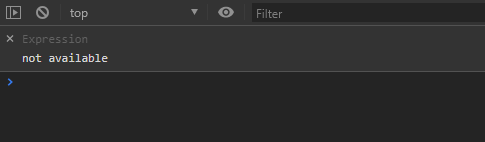
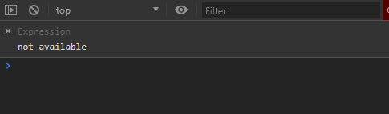

# keypress-handler

> Handler for javascript keyboard events

[](https://www.npmjs.com/package/keypress-handler) [](https://standardjs.com)

## Info

Handler for keyboard events in JS. Wich DOESN'T have debounce time when triggered.

Legacy event handling

```js
document.addEventListener('keydown', handler);
```



```js
kh.onKey(35, handler, { hold: true });
```



## Install

```bash
npm install --save keypress-handler
```

## Usage

Works with either JS or TS (typings included).

Example below provided in React but you can ues any other framework

```ts
kh.run(interval);
```

- runs the watcher
  - **interval** (_number, optional, 100 - default_) - value in _ms_ stands for interval how often en event is fired.

```ts
kh.onKey(keyCode, handler, options);
```

- creates watcher for certain key
  - **keyCode** (_number|string, required_)- js keycode for a key https://keycode.info/
  - **handler** (_function, required_) - handler function for an event
  - **options** (_object, optional_) - configuration options for a watcher
    - **hold** (boolean) - _true_ if needed even firing on hold, _false_ - ONLY 1 event is fired

```js
kh.stop();
```

- stops handling events

# Example

```tsx
import * as React from 'react';

import kh from 'keypress-handler';

class MyComponent extends React.Component {
  public componentDidMount() {
    kh.run(75);
    kh.onKey(32, () => console.log('Keypress-handler works!'), {
      hold: true,
    });
  }

  public componentWillUnmount() {
    kh.stop();
  }

  render() {
    return <div />;
  }
}
```

## License

MIT © [SergeOlabin](https://github.com/SergeOlabin)
